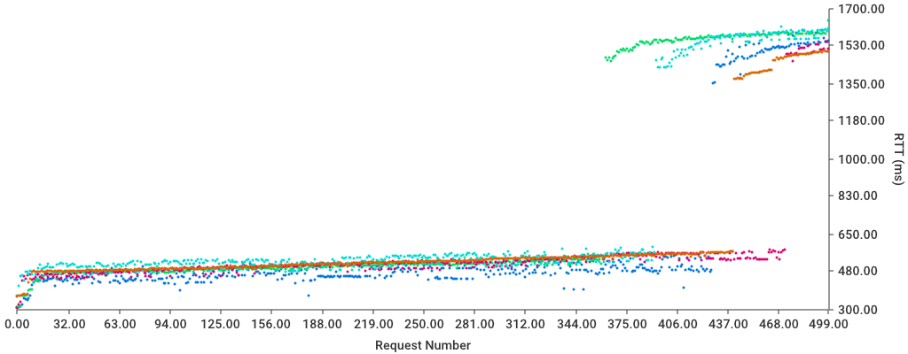
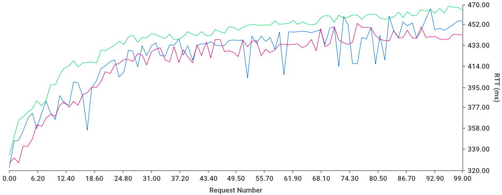

# WebTimer
This is a small Go program designed to test a webserver under load. It was designed for testing my own sites
(see calThing and activityTracker). It accomplishes this by concurrently sending a given amount of GET requests
to the target webpage and measuring the round trip time (RTT).

## Examples
#### Saving a dotted graph
`./webtimer --target "http://localhost:2500" --count 5 --size 500 --delay 1s500ms --graph --dotted --savefile loadTest`

Sends 5 bursts of 500 requests each at the webserver running on port 2500 with a delay of 1500ms between each burst.
It then saves the graph to `loadTest.png`.

#### Saving a line graph
`./webTimer --count 3 --size 100 --graph --savefile loadTest2`

Sends 3 bursts of 100 requests each at the webserver running on port 80, and saves the resulting line graph to `loadTest2.png`.

#### Saving raw data
`./webTimer --count 30 --size 500 --print --savefile loadTest3Raw`

Sends 30 bursts of 500 requests at `http://localhost:80` an saves the raw data to `loadTest3Raw.txt`.
The format is: `burst_number request_number rtt`

## Feature Requests
If you have any problems or would like to see something added to this application, open an Issue and I'll get right to it.
Thanks!